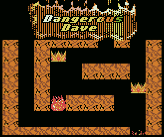

# [Dangerous Dave for TIC-80](https://tic.computer/play?cart=880)

> [Dangerous Dave](https://en.wikipedia.org/wiki/Dangerous_Dave) remake in [TIC-80](https://tic.computer).

Dangerous Dave was originally written by [John Romero](https://en.wikipedia.org/wiki/John_Romero) back in 1988, and released on DOS in 1990. This is the first 9 levels of Dangerous Dave, with a re-designed final level. The remake was built with [TIC-80](https://tic.computer), as a thank you to John Romero.

[Play Online](https://tic.computer/play?cart=880)

## Features

- 9 Levels from the Original
- New Redesigned Final Level
- Save and Continue
- Highscores
- Refined Physics

## Wishlist

- Warpzones
- Mimic Enemy Movement Patterns
- Additional Sound Effects
- Music
- AI Demo (screensaver)
- Color Palette
- Multiplayer

## Play

1. [Play Online](https://tic.computer/play?cart=880)
2. Alternatively, [install TIC-80](https://tic.computer/create)
3. [Download cart.tic](https://github.com/RobLoach/DangerousDave-TIC80/raw/master/cart.tic)
4. Run the cart through TIC-80

## Development

To compile the game, you'll need [Node.js](https://nodejs.org)...

1. [Install TIC-80](https://tic.computer/create)
2. Install [Node.js](https://nodejs.org/en/)
3. Run `npm it`

## License

[GPL-3.0](LICENSE)
